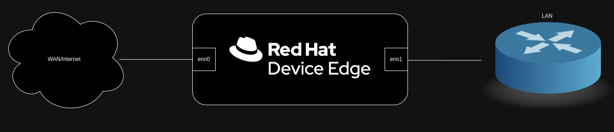

# Bootstrap Demo
This helm chart is a set of core functionality used for offline/disconnected demonstration environments, and for ensuring content availability for hands-on experiences. It is intended to be used with Red Hat Device Edge.

## Architecture

When building environments for investigation of edge architectures, a few key components are required to get up and going quickly:
1. DNS
2. DHCP
3. Offline install content

This chart attempts to provide that functionality by configuring services and mirroring content that can then be physical transported to the evaluation location.

## Components
Currently, the following services and included:
| Name | Type | Requirements |
|------|------| ------------ |
| DNS | ApplicationSet | N/A |
| DHCP | ApplicationSet | N/A |
| oc-mirror | ApplicationSet + Job | 70GB Storage |

## What You Are Responsible For
1. Ensure your device has two NICs connected, one with internet access for syncing
2. Configure one interface to be trusted, so firewalld doesn't block incoming DNS/DHCP requests
3. Ensure the LAN interface has a static address
4. Ensure Microshift is installed/started

## Installation

Fill out the `values.yaml` file with the appropriate information, then use Helm to install:
`helm install -f yalues.yaml ./`

